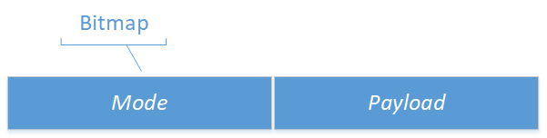
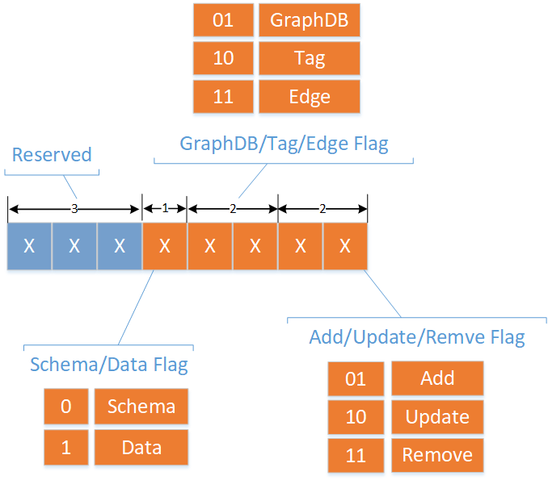
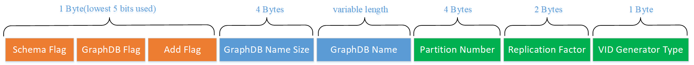
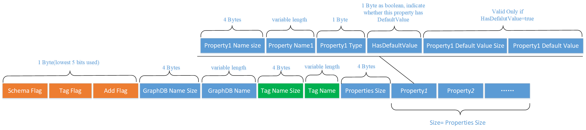
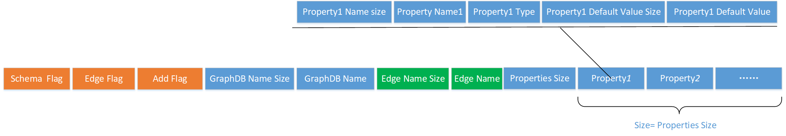
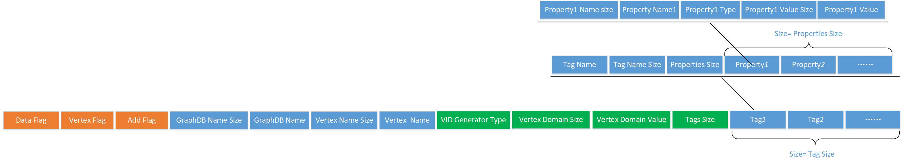
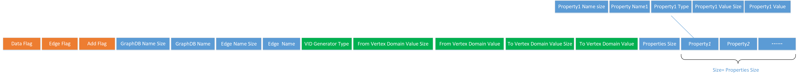

# Epik knowledge graph binary log file encoder.
Spark job that encoding triplets to Epik knowledge graph binary-log files.

## Prerequisites
1. JDK1.8   
Install java-1.8.0-openjdk-devel for you OS, set JAVA_HOME environment variable. and add $JAVA_HOME/bin to your PATH.

2. Maven3.6+   
Install [apache Maven](http://maven.apache.org/install.html), make M2_HOME environment variable point to it, and add $M2_HOME/bin to your PATH.

3. [Hadoop 3.2.2](https://archive.apache.org/dist/hadoop/common/hadoop-3.2.2/hadoop-3.2.2.tar.gz)  
Setup a [pseudo-distributed](http://hadoop.apache.org/docs/r3.2.2/hadoop-project-dist/hadoop-common/SingleCluster.html#Pseudo-Distributed_Operation) hadoop cluster. Or [full-distributed](http://hadoop.apache.org/docs/r3.2.2/hadoop-project-dist/hadoop-common/SingleCluster.html#Fully-Distributed_Operation) if you have spare resources.
Make HADOOP_HOME environment variable point to where you extracted tar.gz files, and add $HADOOP_HOME/bin and $HADOOP_HOME/sbin to your PATH.
Start hdfs and yarn services.

4. Spark 3.0.1   
Since we use spark-on-yarn as our distributed computing engine, and use a custom version of Hadoop 3.2.2, we need to build spark from source.
```bash
curl https://codeload.github.com/apache/spark/tar.gz/refs/tags/v3.0.1 -o spark-3.0.1.tar.gz
tar zxvf spark-3.0.1.tar.gz
cd spark-3.0.1
./dev/make-distribution.sh --name epik --tgz -Phive -Phadoop-3.2 -Dhadoop.version=3.2.2 -Pscala-2.12 -Phive-thriftserver -Pyarn -Pkubernetes -DskipTests -X
```
When done, extract `spark-3.0.1-bin-epik-spark-3.0.1.tgz`, make environment variable SPARK_HOME point to it, and add $SPARK_HOME/bin to your PATH.

5. sbt   
Install scala build tool [sbt](https://www.scala-sbt.org/), need it when building epik-gateway-binlog-encoder spark job.  
```bash
curl https://github.com/sbt/sbt/releases/download/v1.4.8/sbt-1.4.8.tgz 
tar zxvf sbt-1.4.8.tgz  -C /opt/
ln -s /opt/sbt-1.4.8 /opt/sbt
export SBT_HOME=/opt/sbt
export PATH=$SBT_HOME/bin:$PATH
```

## Build java [nebula-client](https://github.com/vesoft-inc/nebula-java)
```bash
git clone https://github.com/vesoft-inc/nebula-java.git
cd nebula-java
mvn clean install -Dcheckstyle.skip=true -DskipTests -Dgpg.skip -X
```
Current version is 2.0.0-SNAPSHOT(note we disable the annoying checks.)

## Build epik-gateway-binlog-encoder spark job
```bash
git clone https://github.com/EpiK-Protocol/epik-gateway-binlog-encoder.git
cd epik-gateway-binlog-encoder
sbt assembly
```

epik-gateway-binlog-encoder spark job jar file should be generated in:

```bash
epik-gateway-binlog-encoder/target/scala-2.12/epik-gateway-binlog-encoder.jar
```

## Prepare the input cn_pedia input files  
Download [cn_dbpedia archive file](http://openkg1.oss-cn-beijing.aliyuncs.com/35f5fa1d-57a8-49b4-81ac-eace85f7a578/baiketriples.zip), which is in triplet format.  
Unzip it, got `baike_cnpedia.txt`, make a dir in hdfs and put it over there.  
```bash
hdfs dfs -mkdir /cn_dbpedia_input
hdfs dfs -put baike_cnpedia.txt /cn_dbpedia_input/
```

## Submit epik-gateway-binlog-encoder spark job to spark-on-yarn cluster.  
```bash
${SPARK_HOME}/bin/spark-submit --class com.epik.kbgateway.DomainKnowledge2LogFile --master yarn --deploy-mode cluster --driver-memory 256M --driver-java-options "-Dspark.testing.memory=536870912" --executor-memory 6g  --num-executors 4 --executor-cores 2 /root/epik-gateway-binlog-encoder.jar -f /cn_dbpedia_input/baike_triples.txt -d cn_dbpedia -t /epik_log_output
```
The main class name is `com.epik.kbgateway.DomainKnowledge2LogFile`. Note We put epik-gateway-binlog-encoder.jar under /root dir, point to where you put it if it is not the case.

Application options:

option name| example |note
:---:|:---|---
-f | /cn_dbpedia_input/baike_triples.txt | hdfs input file, location of baike_cnpedia.txt
-d | cn_dbpedia | nebula database name. 
-t | /epik_log_output | hdfs output files, where the binlog locates.

## How to build using docker

```bash
#Build a docker image using the `Dockerfile` we provided.
docker build -t epik-gateway-binlog-encoder:1.0 .

#Start a container from that image.
docker run -it epik-gateway-binlog-encoder:1.0 /bin/bash

#checkout the conainter's id from the following output, which is 0da791e29253 in our case.
docker container ls -a

# Copy the already-built spark job jar from the container to local.The you can sumbit it to a spark cluster.
docker cp 0da791e29253:/root/epik-gateway-binlog-encoder/target/scala-2.12/epik-gateway-binlog-encoder.jar .
```

## Log format

Basically every Log is composed of 2 components: 


1. _Mode_ , a bitMap, used to interpret the _Payload_, different bit combination indicate different log type.
2. _Payload_, the actual log content.

_Mode_ is 1 byte long, which is divided into 4 subsections from lowest to the highest bit.
1. The lowest 2 bits are Add/Update/Remove mode.
2. The next 2 bits are GraphDB/Tag/Edge mode.
3. The next 1 bit is Schema/Data(instances) mode.
4. The highest 3 bits are reserved for later usage.



Combination of those bits, can form any of the following logs.
1. GraphDB/Tag/Edge's Schema Add/Update/Remove Log.
2. Tag/Edge's Data(instances) Add/Update/Remove Log.


### GraphDB Schema Log
GraphDB Schema Log is used to manipulate graph space's defination in schema.


In order to support multi knowledge graphs, GraphDB is introduced to support conceptual and physical data organization, which has a counterpart in Relational Database Management System(RDBMS).
GraphDB's naming convention follows the identifier naming convention of typical programming language such as c/c++, which should be composed of alphabet、digit、underscore and $, and should not starts with 
digit. GraphDB names that starts with underscore or $ are reserved for internal usage. Since GraphDB's name can be of variable length, name's size should be encoded. 
We use a [Nebula Graph](https://nebula-graph.io/) as our backend graph database. Nebula Graph is a distributed graph database, __partition number__ and __replication factor__ should be specified when creating a graphspace.
which could not be altered after creation., so in order to harvest the power when scale-out, a modest partition number should be used, 1024 or higher is recommended.
Replication is used to maintain fault-tolerance. Graph database should be functional under at most minority of all replicas fails.
But replication has its drawback too, it will cause storage-bloat when set too high, an odd small number such as 3、5 or 7 is recommended, the most common setting is 3.


### Tag Schema Log
Tag Schema Log is used to manipulate Tag's defination in schema.

In order to support multi-graphdb, __GraphDB Name__ and __GraphDB Name Size__ is added as prefix to indicate which graphdb this Tag Schema Log belongs to.
Although usually graph database maintain a internal GraphDB id to uniquely identify it, it also maintains the relationship between GraphDB Name and GraphDB id.
But we could not know the GraphDB id before it actually created in graph database, and got assigned its GraphDB id, we should make our log self-contained.
so we put <GraphDB Name Size，GraphDB Name>, a tuple2 composite field in every log to distinguish which graphdb it belongs to.

Tag is a label which assign to a Vertex, which may usually represent a `concept` a vertex has, is a logical group of properties.
And Vertex is conceptually a tuple2 of <VID,TagList>, which VID is a integer assigned by Nebula Graph to uniquely identify a vertex internally, and TagList is a collection of Tags, which indicates that a vertex can have many concepts.


A Tag is conceptually a tuple2 of <TagName, PropertiesList>, which TagName is Tag' name(variable length, so its name's size should be encoded inside), and PropertiesList is a collection of Property, which defined as:
1.	Property Name: name of the property.
2.	Property Type：support common data type, including: integer、double、string and timestamp. When of type string, since it is variable length, an extra size field will be encoded to mark its boundary.
3.	Property Value: value of the property according to Property Type.
4.	Property Default Value： default value if the value is absent.
In order to support __PropertiesList__, an extras __Properties Szie__ field to count how many properties a Tag has.


### Edge Schema Log
Edge Schema Log is used to manipulate Edge's defination in schema. 

It bears much resemblance with Tag Schema Log. The only different is that we change __Tag Name Size__ to __Edge Name Size__, and change __Tag Name__ to __Edge Name__.

###	Vertex Data Log
Vertex Data Log is used to manipulate vertex's data.

As mentioned in __Tag Schema Log__，Vertex is conceptually a tuple2 of <VID, TagList>.
Nebula Graph make a conversion from domain values to integer vertex(VID) id to reduce to maintenance overhead. Nebula Graph also expose native functions to do for application developments.
such as __Hash__ or __Fixed-size String__. We use __Hash__ function, but it is our responsibility to make sure that every domain entity(business entity) is unique.
Vertex Data Log is composed of the following:
1. Vertex Domain Value Size: value's size of the domain entity,to mark its boundary.
2. Vertex Domain Value： domain entity's value，must be of string type.
3. VID Generator Type: the function we used to make the domain entity to VID conversion. we use __Hash__.
4. TagList: a collection of Tag，a Tag is tuple5 of<Property Name Size, Property Name, Property Type, Property Value Size, Property Value>, which every __Size__ field is used to mark the boundary of the corresponding __Value__ field. 

### Edge Data Log
__Edge Data Log__ is used to manipulate edge's data.

It bears much resemblance with __Vertex Data Log__ with minor differences:
1.	Edge is connected by a __From Vertex__ and a __To Vertex__, which require __From Vertex Domain Value__ and __To Vertex Domain Value__，and corresponding Value Sizes fields.
2.	Edge does not support multi-Tag，so does not need introduce filed designed for multi-Tags，Edge's properties just lay one after another，every property is tuple5 of <Property Name Size, Property Name, Property Type, Property Value Size, Property Value>.


